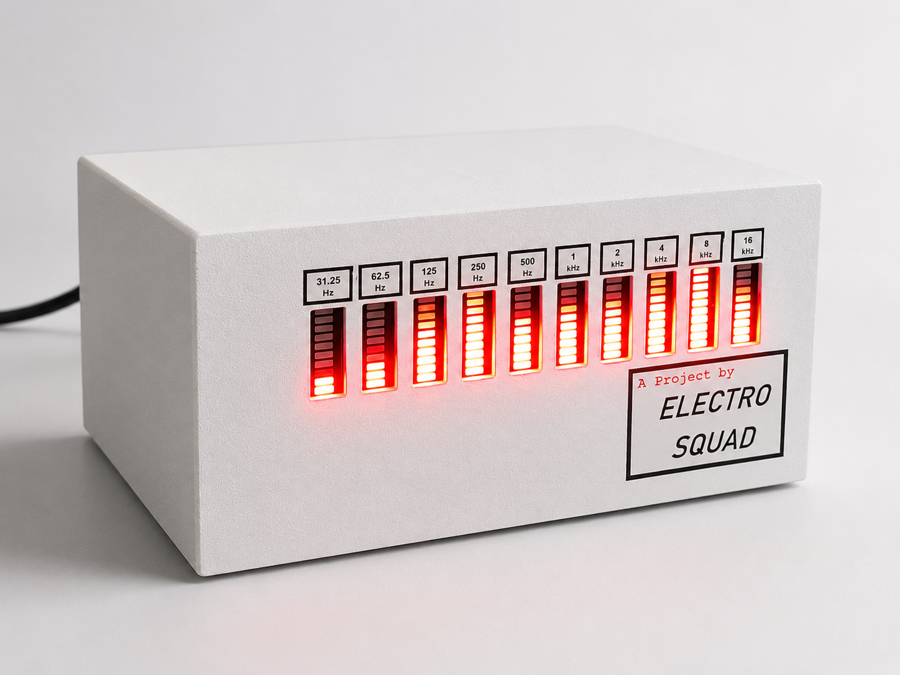

# 10-Band Analog Audio Spectrum Analyzer

## Overview
This repository contains the complete hardware design, schematics, and testing documentation for a fully analog 10-band audio spectrum analyzer. The system processes incoming audio signals, isolates specific frequency bands, and visually maps the amplitude of each band using LED bar graphs. 

This project demonstrates full-stack analog hardware design from theoretical calculations to physical breadboard prototyping.

## Working Demonstration
Watch the fully analog analyzer in action below:

<video src="./prototype testing/Demo.mp4" controls="controls" width="100%"></video>
*(Note: If you placed the video inside the Media folder instead, change the path above to `./Media/Demo.mp4`)*

---

## System Architecture
The circuit avoids digital processing and relies entirely on precision analog components, divided into three core stages:

*   **Filter Stage:** Second-order Multiple Feedback (MFB) Band Pass Filters isolate 10 distinct audio frequency bands across the human hearing spectrum.
*   **Peak Detector Stage:** Precision Op-Amp based peak detectors capture the maximum amplitude of the filtered AC signals to provide a stable DC voltage for the display.
*   **Display Driver Stage:** LM3914 LED driver ICs, configured in "bar mode," map the analog voltage levels to 10-segment LED columns.

---

## Repository Structure

| Folder / File | Description |
| :--- | :--- |
| `Media/` | Contains high-quality project images, including FrontView2.1. |
| `prototype testing/` | Contains hardware demonstration videos and real-world oscilloscope trace results. |
| `spectrum_analyzer.pdf` | Comprehensive, professionally typeset project documentation and derivations. |
| `spectrum_analyzer.tex` | LaTeX source code used to generate the final documentation. |
| `Note1.pdf` | Original handwritten design notes and raw mathematical calculations. |

---

## Contribution
Team ElectroSquad
Department of Electronic and Telecommunication Engineering (ENTC)  
University of Moratuwa
